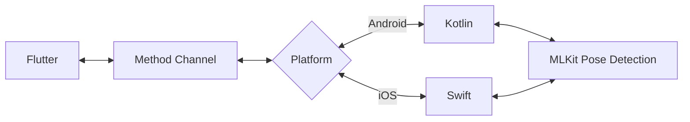

# Pose Detection

## Structure

## Rendering

iOS [DrawRenderer.swift](https://github.com/ShuheiYoshidaJP/shus_flutter/blob/develop/ios/Runner/Feature/Pose/DrawRenderer.swift)

Android [DrawRenderer.kt](https://github.com/ShuheiYoshidaJP/shus_flutter/blob/develop/android/app/src/main/kotlin/com/example/shus_flutter/feature/pose/DrawRenderer.kt)