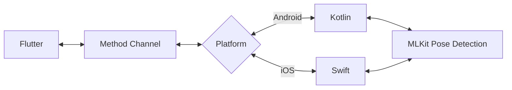

# Pose Detection

## Structure

```mermaid
graph LR
    A[Flutter] <--> B[Method Channel]
    B <--> C{Platform}
    C <-->|Android| D[Kotlin]
    C <-->|iOS| E[Swift]
    D <--> F[MLKit Pose Detection]
    E <--> F
```
